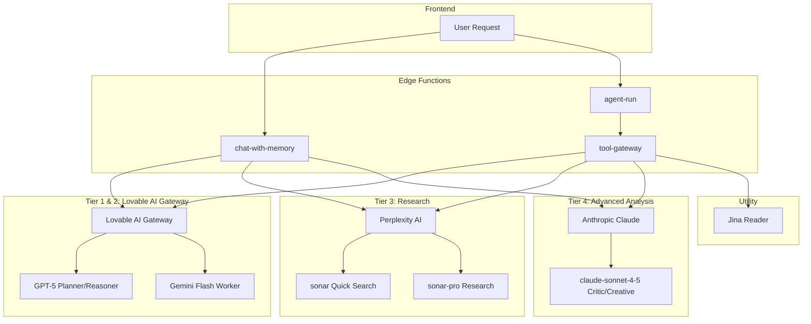

# Atlas API Reference

Complete documentation for all Supabase Edge Functions in the Atlas project.

## Base URL

All endpoints are accessed via the Supabase Functions URL:
```
https://gyfllxzecctdnmxqgazo.supabase.co/functions/v1/{function-name}
```

## Authentication

Most endpoints require a valid Supabase JWT token in the Authorization header:

```bash
Authorization: Bearer <supabase-jwt-token>
```

Public endpoints (marked with 🔓) can be called without authentication.

---

## AI Provider Architecture

Atlas uses a sophisticated multi-model AI architecture that routes different task types to specialized AI providers for optimal performance.

### Architecture Overview



### AI Providers

| Provider | Models | Use Case | API Key |
|----------|--------|----------|---------|
| **Lovable AI Gateway** | `openai/gpt-5`, `google/gemini-2.5-flash`, `google/gemini-2.5-pro` | General reasoning, planning, verification | `LOVABLE_API_KEY` (auto-configured) |
| **Anthropic Claude** | `claude-sonnet-4-5` | Advanced reasoning, code review, creative writing | `ANTHROPIC_API_KEY` |
| **Perplexity AI** | `sonar`, `sonar-pro`, `sonar-reasoning` | Real-time web search, deep research | `PERPLEXITY_API_KEY` |
| **Jina Reader** | N/A | Web page scraping, content extraction | Free (no key required) |

### Model Tier System

The `agent-run` function uses a 4-tier model system for different cognitive tasks:

```typescript
// Model tiers and their purposes
type TaskType = 
  | 'planner' | 'worker' | 'reasoner'           // Tier 1 & 2
  | 'research' | 'web_search'                   // Tier 3
  | 'critic' | 'creative' | 'code_review';      // Tier 4

const PROVIDERS = {
  lovable: {    // Tier 1 & 2
    planner: 'openai/gpt-5',
    worker: 'google/gemini-2.5-flash',
    reasoner: 'openai/gpt-5'
  },
  anthropic: {  // Tier 4
    critic: 'claude-sonnet-4-5',
    creative: 'claude-sonnet-4-5'
  },
  perplexity: { // Tier 3
    research: 'sonar-pro',
    search: 'sonar'
  }
};
```

### Model Selection Logic

The `selectModel()` function in `agent-run` dynamically routes tasks to the most appropriate model:

```typescript
function selectModel(taskType: string, agentConfig?: ModelConfig): { provider: string; model: string } {
  switch (taskType) {
    // Tier 4: Anthropic Claude for advanced analysis
    case 'code_review':
    case 'code_analysis':
    case 'critic':
      return { provider: 'anthropic', model: 'claude-sonnet-4-5' };
    case 'creative_writing':
    case 'creative':
    case 'nuanced_response':
      return { provider: 'anthropic', model: 'claude-sonnet-4-5' };
    case 'complex_reasoning':
    case 'multi_step_logic':
      return { provider: 'anthropic', model: 'claude-sonnet-4-5' };
    
    // Tier 3: Perplexity for research
    case 'research':
    case 'web_research':
    case 'deep_analysis':
      return { provider: 'perplexity', model: 'sonar-pro' };
    case 'web_search':
    case 'quick_search':
      return { provider: 'perplexity', model: 'sonar' };
    
    // Tier 1: Planning with best reasoning
    case 'planning':
      return { provider: 'lovable', model: 'openai/gpt-5' };
    
    // Tier 1: Verification
    case 'verification':
    case 'reasoning':
      return { provider: 'lovable', model: 'openai/gpt-5' };
    
    // Tier 2: Execution with fast model
    case 'execution':
    case 'tool_call':
    default:
      return { provider: 'lovable', model: 'google/gemini-2.5-flash' };
  }
}
```

### Provider Configuration

#### Lovable AI Gateway

The primary AI provider, accessed via `https://ai.gateway.lovable.dev/v1/chat/completions`:

```typescript
const response = await fetch('https://ai.gateway.lovable.dev/v1/chat/completions', {
  method: 'POST',
  headers: {
    'Authorization': `Bearer ${Deno.env.get('LOVABLE_API_KEY')}`,
    'Content-Type': 'application/json',
  },
  body: JSON.stringify({
    model: 'google/gemini-2.5-flash', // or 'openai/gpt-5', 'google/gemini-2.5-pro'
    messages: [
      { role: 'system', content: 'You are a helpful assistant.' },
      { role: 'user', content: 'Hello!' }
    ],
    stream: true, // SSE streaming supported
  }),
});
```

**Available Models:**
| Model | Best For | Speed | Cost |
|-------|----------|-------|------|
| `openai/gpt-5` | Complex reasoning, planning | Medium | High |
| `google/gemini-2.5-pro` | Multimodal, long context | Medium | High |
| `google/gemini-2.5-flash` | General tasks, speed | Fast | Low |
| `google/gemini-2.5-flash-lite` | Simple tasks, classification | Fastest | Lowest |

#### Anthropic Claude (Tier 4)

Used for advanced reasoning, code review, and creative tasks:

```typescript
const response = await fetch('https://api.anthropic.com/v1/messages', {
  method: 'POST',
  headers: {
    'x-api-key': Deno.env.get('ANTHROPIC_API_KEY'),
    'anthropic-version': '2023-06-01',
    'content-type': 'application/json',
  },
  body: JSON.stringify({
    model: 'claude-sonnet-4-5',
    max_tokens: 4096,
    system: 'You are an expert code reviewer.',
    messages: [
      { role: 'user', content: 'Review this code for potential issues...' }
    ],
  }),
});

const data = await response.json();
// data.content[0].text: Response text
```

**Available Models:**
| Model | Description | Use Case |
|-------|-------------|----------|
| `claude-sonnet-4-5` | Most capable, intelligent reasoning | Code review, complex analysis, creative writing |

**Best Use Cases:**
- Code review and security analysis
- Creative writing with nuanced responses
- Complex multi-step reasoning
- Architecture and design decisions

#### Perplexity AI (Tier 3)

Used for web-grounded responses and research:

```typescript
const response = await fetch('https://api.perplexity.ai/chat/completions', {
  method: 'POST',
  headers: {
    'Authorization': `Bearer ${Deno.env.get('PERPLEXITY_API_KEY')}`,
    'Content-Type': 'application/json',
  },
  body: JSON.stringify({
    model: 'sonar-pro',
    messages: [
      { role: 'user', content: 'What are the latest AI developments?' }
    ],
  }),
});

// Response includes citations
const data = await response.json();
// data.citations: ["https://example.com/article1", ...]
```

**Available Models:**
| Model | Description | Use Case |
|-------|-------------|----------|
| `sonar` | Fast web search | Quick factual lookups |
| `sonar-pro` | Multi-step search with 2x citations | Research, complex queries |
| `sonar-reasoning` | Chain-of-thought with search | Analysis, reasoning tasks |

#### Jina Reader (Utility)

Free web scraping service for content extraction:

```typescript
const response = await fetch(`https://r.jina.ai/${encodeURIComponent(url)}`, {
  headers: {
    'Accept': 'application/json',
  },
});

const data = await response.json();
// data.content: Markdown-formatted page content
// data.title: Page title
// data.description: Meta description
```

### Fallback Behavior

The system implements graceful fallbacks when providers are unavailable:

```
Primary Path:
┌─────────────┐    ┌─────────────┐    ┌─────────────┐
│  Perplexity │───▶│ Lovable AI  │───▶│   Error     │
│   (search)  │    │  (fallback) │    │  Response   │
└─────────────┘    └─────────────┘    └─────────────┘

Research Flow:
1. Try Perplexity sonar-pro for web-grounded research
2. If PERPLEXITY_API_KEY missing → fallback to Lovable AI Gemini
3. If both fail → return error with partial results
```

**Implementation Example:**
```typescript
async function searchWeb(query: string): Promise<SearchResult> {
  const perplexityKey = Deno.env.get('PERPLEXITY_API_KEY');
  
  if (perplexityKey) {
    try {
      return await perplexitySearch(query, perplexityKey);
    } catch (error) {
      console.warn('Perplexity failed, falling back to Lovable AI');
    }
  }
  
  // Fallback to Lovable AI (without real-time web access)
  return await lovableAISearch(query);
}
```

### Required Secrets

| Secret | Provider | Required | Description |
|--------|----------|----------|-------------|
| `LOVABLE_API_KEY` | Lovable AI Gateway | ✅ Auto-configured | Access to GPT-5 and Gemini models |
| `ANTHROPIC_API_KEY` | Anthropic Claude | ⚠️ Optional | Advanced reasoning, code review, creative tasks |
| `PERPLEXITY_API_KEY` | Perplexity AI | ⚠️ Optional | Web search and research capabilities |
| `ELEVENLABS_API_KEY` | ElevenLabs | ✅ For voice | Speech-to-text and text-to-speech |

### Agent Model Configuration

Agents can override default model selection via the `model_config_json` field:

```typescript
interface AgentModelConfig {
  planner?: string;    // Model for planning phase
  worker?: string;     // Model for execution phase  
  reasoner?: string;   // Model for verification phase
  temperature?: number;
  maxTokens?: number;
}

// Example agent configuration
const agent = {
  name: 'Research Assistant',
  system_prompt: '...',
  model_config_json: {
    planner: 'openai/gpt-5',
    worker: 'sonar-pro',  // Use Perplexity for research-heavy tasks
    reasoner: 'google/gemini-2.5-pro',
    temperature: 0.7,
  },
};
```

### Rate Limits by Provider

| Provider | Limit | Scope |
|----------|-------|-------|
| Lovable AI Gateway | Varies by plan | Per workspace |
| Anthropic Claude | 50 req/min (tier 1), 1000 req/min (tier 4) | Per API key |
| Perplexity AI | 50 req/min (free), 600 req/min (pro) | Per API key |
| Jina Reader | Unlimited | Free tier |

---

## Core AI Functions

### POST `/chat-with-memory`

Main AI conversation endpoint with persistent memory, tool calling, and citation support.

**Request Body:**
```typescript
interface ChatRequest {
  messages: Array<{
    role: 'user' | 'assistant' | 'system';
    content: string;
  }>;
  userId?: string;           // Required for memory features
  enableTools?: boolean;     // Enable web search, research tools
  teachingMode?: boolean;    // Enable knowledge extraction
  systemPrompt?: string;     // Override default system prompt
}
```

**Response:** Server-Sent Events (SSE) stream

```typescript
// Content chunk
data: {"type":"content","text":"Hello! How can I help..."}

// Citation
data: {"type":"citation","citation":{"title":"...","url":"...","snippet":"..."}}

// Tool call
data: {"type":"tool_call","tool":"web_search","args":{"query":"..."}}

// Tool result
data: {"type":"tool_result","tool":"web_search","result":{...}}

// Done
data: {"type":"done"}
```

**Available Tools:**
| Tool | Description |
|------|-------------|
| `web_search` | Search the web via Perplexity |
| `deep_research` | In-depth research on a topic |
| `web_scrape` | Extract content from a URL |
| `memory_store` | Store information to memory |
| `memory_recall` | Retrieve from memory |

**Example:**
```bash
curl -X POST \
  'https://gyfllxzecctdnmxqgazo.supabase.co/functions/v1/chat-with-memory' \
  -H 'Authorization: Bearer YOUR_TOKEN' \
  -H 'Content-Type: application/json' \
  -d '{
    "messages": [{"role": "user", "content": "What is the weather like today?"}],
    "enableTools": true
  }'
```

---

### POST `/atlas-knowledge`

Extract and store knowledge from conversations for long-term memory.

**Request Body:**
```typescript
interface KnowledgeRequest {
  conversation: Array<{
    role: 'user' | 'assistant';
    content: string;
  }>;
  userId: string;
  source?: string;  // e.g., "teaching_session", "chat"
}
```

**Response:**
```typescript
interface KnowledgeResponse {
  success: boolean;
  extracted: number;    // Number of knowledge items extracted
  stored: number;       // Number successfully stored
  items?: Array<{
    topic: string;
    content: string;
    confidence: number;
  }>;
}
```

**Example:**
```bash
curl -X POST \
  'https://gyfllxzecctdnmxqgazo.supabase.co/functions/v1/atlas-knowledge' \
  -H 'Authorization: Bearer YOUR_TOKEN' \
  -H 'Content-Type: application/json' \
  -d '{
    "conversation": [
      {"role": "user", "content": "My favorite color is blue"},
      {"role": "assistant", "content": "I will remember that!"}
    ],
    "userId": "user-uuid",
    "source": "teaching_session"
  }'
```

---

### POST `/atlas-knowledge-validator`

Validate and deduplicate knowledge entries before storage.

**Request Body:**
```typescript
interface ValidatorRequest {
  entries: Array<{
    topic: string;
    content: any;
    confidence: number;
  }>;
  userId: string;
}
```

**Response:**
```typescript
interface ValidatorResponse {
  valid: Array<{...}>;      // Entries that passed validation
  duplicates: Array<{...}>; // Entries that already exist
  invalid: Array<{...}>;    // Entries that failed validation
}
```

---

### POST `/atlas-research`

Initiate background research on a topic.

**Request Body:**
```typescript
interface ResearchRequest {
  topic: string;
  depth?: 'shallow' | 'medium' | 'deep';  // Default: 'medium'
  userId?: string;
  parentTopicId?: string;  // For sub-topic research
}
```

**Response:**
```typescript
interface ResearchResponse {
  topicId: string;
  status: 'queued' | 'in_progress' | 'completed';
  findings?: Array<{
    title: string;
    summary: string;
    sources: Citation[];
  }>;
}
```

---

### POST `/memory-embed`

Generate embeddings for memory items to enable semantic search.

**Request Body:**
```typescript
interface EmbedRequest {
  text: string;
  memoryItemId?: string;
  knowledgeEntryId?: string;
  userId: string;
}
```

**Response:**
```typescript
interface EmbedResponse {
  success: boolean;
  vectorId: string;
  dimensions: number;
}
```

---

## Voice Functions

### POST `/elevenlabs-scribe-token` 🔓

Get a single-use token for ElevenLabs real-time speech-to-text.

**Request Body:** None required

**Response:**
```typescript
interface TokenResponse {
  token: string;           // Single-use WebSocket token
  expiresAt: string;       // ISO timestamp
}
```

**Example:**
```bash
curl -X POST \
  'https://gyfllxzecctdnmxqgazo.supabase.co/functions/v1/elevenlabs-scribe-token' \
  -H 'Content-Type: application/json'
```

**Usage with WebSocket:**
```typescript
const ws = new WebSocket(
  `wss://api.elevenlabs.io/v1/speech-to-text/streaming?token=${token}`
);
```

---

### POST `/elevenlabs-tts`

Convert text to speech (non-streaming, returns complete audio).

**Request Body:**
```typescript
interface TTSRequest {
  text: string;
  voiceId?: string;         // Default: 'Rachel'
  modelId?: string;         // Default: 'eleven_turbo_v2_5'
  stability?: number;       // 0-1, default: 0.5
  similarityBoost?: number; // 0-1, default: 0.75
}
```

**Response:**
```typescript
interface TTSResponse {
  audioContent: string;  // Base64-encoded audio (MP3)
  duration?: number;     // Audio duration in seconds
}
```

**Example:**
```bash
curl -X POST \
  'https://gyfllxzecctdnmxqgazo.supabase.co/functions/v1/elevenlabs-tts' \
  -H 'Authorization: Bearer YOUR_TOKEN' \
  -H 'Content-Type: application/json' \
  -d '{"text": "Hello, how are you today?"}'
```

---

### POST `/elevenlabs-tts-stream`

Stream text-to-speech audio in real-time.

**Request Body:**
```typescript
interface TTSStreamRequest {
  text: string;
  voiceId?: string;
  modelId?: string;
}
```

**Response:** Binary audio stream (`audio/mpeg`)

**Example:**
```bash
curl -X POST \
  'https://gyfllxzecctdnmxqgazo.supabase.co/functions/v1/elevenlabs-tts-stream' \
  -H 'Authorization: Bearer YOUR_TOKEN' \
  -H 'Content-Type: application/json' \
  -d '{"text": "Hello, how are you today?"}' \
  --output speech.mp3
```

---

### POST `/elevenlabs-stt`

Transcribe audio file to text (non-streaming).

**Request Body:**
```typescript
interface STTRequest {
  audio: string;        // Base64-encoded audio
  languageCode?: string; // e.g., 'en', 'da'
}
```

**Response:**
```typescript
interface STTResponse {
  text: string;
  confidence: number;
  language: string;
}
```

---

## Data Functions

### POST `/get-weather`

Fetch current weather and hourly forecast.

**Request Body:**
```typescript
interface WeatherRequest {
  city?: string;      // City name (e.g., "Copenhagen")
  lat?: number;       // Latitude (alternative to city)
  lon?: number;       // Longitude (alternative to city)
  units?: 'metric' | 'imperial';  // Default: 'metric'
}
```

**Response:**
```typescript
interface WeatherResponse {
  location: {
    city: string;
    country: string;
    lat: number;
    lon: number;
  };
  current: {
    temp: number;
    feelsLike: number;
    humidity: number;
    windSpeed: number;
    condition: string;
    icon: string;
    description: string;
  };
  hourly: Array<{
    time: string;
    temp: number;
    condition: string;
    icon: string;
    precipProbability: number;
  }>;
  alerts?: Array<{
    event: string;
    description: string;
    start: string;
    end: string;
  }>;
}
```

**Example:**
```bash
curl -X POST \
  'https://gyfllxzecctdnmxqgazo.supabase.co/functions/v1/get-weather' \
  -H 'Authorization: Bearer YOUR_TOKEN' \
  -H 'Content-Type: application/json' \
  -d '{"city": "Copenhagen"}'
```

---

### POST `/get-news`

Fetch top news headlines by category.

**Request Body:**
```typescript
interface NewsRequest {
  category?: 'general' | 'business' | 'technology' | 'sports' | 'entertainment' | 'health' | 'science';
  country?: string;    // ISO country code, default: 'us'
  pageSize?: number;   // Max articles, default: 10
  query?: string;      // Search query
}
```

**Response:**
```typescript
interface NewsResponse {
  articles: Array<{
    title: string;
    description: string;
    url: string;
    urlToImage: string;
    publishedAt: string;
    source: {
      name: string;
    };
    author?: string;
  }>;
  totalResults: number;
}
```

**Example:**
```bash
curl -X POST \
  'https://gyfllxzecctdnmxqgazo.supabase.co/functions/v1/get-news' \
  -H 'Authorization: Bearer YOUR_TOKEN' \
  -H 'Content-Type: application/json' \
  -d '{"category": "technology", "pageSize": 5}'
```

---

### POST `/get-stocks`

Fetch stock quotes with price history for sparklines.

**Request Body:**
```typescript
interface StocksRequest {
  symbols: string[];   // Stock symbols, e.g., ["AAPL", "GOOGL"]
}
```

**Response:**
```typescript
interface StocksResponse {
  stocks: Array<{
    symbol: string;
    name: string;
    price: number;
    change: number;
    changePercent: number;
    high: number;
    low: number;
    open: number;
    previousClose: number;
    sparkline: number[];  // Recent price points for chart
    timestamp: string;
  }>;
}
```

**Example:**
```bash
curl -X POST \
  'https://gyfllxzecctdnmxqgazo.supabase.co/functions/v1/get-stocks' \
  -H 'Authorization: Bearer YOUR_TOKEN' \
  -H 'Content-Type: application/json' \
  -d '{"symbols": ["AAPL", "MSFT", "GOOGL"]}'
```

---

### GET `/stocks-realtime`

WebSocket endpoint for real-time stock updates.

**Query Parameters:**
- `symbols` - Comma-separated stock symbols

**WebSocket Messages:**
```typescript
// Subscribe
{"type": "subscribe", "symbols": ["AAPL", "MSFT"]}

// Update (server → client)
{"type": "update", "symbol": "AAPL", "price": 178.50, "change": 1.25}
```

---

## Agent & Scheduling Functions

### POST `/schedules`

Create a new scheduled agent task.

**Request Body:**
```typescript
interface CreateScheduleRequest {
  agentId: string;
  name: string;
  description?: string;
  cronExpression: string;  // e.g., "0 9 * * *" (9 AM daily)
  payload?: Record<string, any>;
  enabled?: boolean;
}
```

**Response:**
```typescript
interface ScheduleResponse {
  id: string;
  agentId: string;
  name: string;
  cronExpression: string;
  nextRunAt: string;
  enabled: boolean;
}
```

---

### GET `/schedules`

List all schedules for the authenticated user.

**Response:**
```typescript
interface SchedulesListResponse {
  schedules: ScheduleResponse[];
}
```

---

### DELETE `/schedules?id={scheduleId}`

Delete a schedule.

**Response:**
```typescript
{ success: true }
```

---

### POST `/schedules?action=toggle&id={scheduleId}`

Toggle a schedule's enabled state.

**Response:**
```typescript
{
  id: string;
  enabled: boolean;
}
```

---

### POST `/schedules?action=run-now&id={scheduleId}`

Trigger immediate execution of a schedule.

**Response:**
```typescript
{
  runId: string;
  status: 'started';
}
```

---

### POST `/agent-run`

Execute an agent task immediately.

**Request Body:**
```typescript
interface AgentRunRequest {
  agentId: string;
  goalText: string;
  context?: Record<string, any>;
}
```

**Response:**
```typescript
interface AgentRunResponse {
  runId: string;
  status: 'queued' | 'running' | 'completed' | 'failed';
  result?: any;
  error?: string;
}
```

---

### POST `/approvals`

Submit an approval decision for a pending tool call.

**Request Body:**
```typescript
interface ApprovalRequest {
  approvalId: string;
  decision: 'approved' | 'rejected';
  reason?: string;
}
```

**Response:**
```typescript
interface ApprovalResponse {
  success: boolean;
  toolCallId: string;
  status: 'approved' | 'rejected';
}
```

---

### GET `/approvals`

List pending approvals for the authenticated user.

**Response:**
```typescript
interface ApprovalsListResponse {
  approvals: Array<{
    id: string;
    toolCallId: string;
    actionSummary: string;
    riskLevel: 'low' | 'medium' | 'high';
    expiresAt: string;
    createdAt: string;
  }>;
}
```

---

### POST `/tool-gateway`

Central tool execution endpoint (used internally by agent runs).

**Request Body:**
```typescript
interface ToolGatewayRequest {
  toolName: string;
  args: Record<string, any>;
  runId?: string;
  stepId?: string;
}
```

**Response:**
```typescript
interface ToolGatewayResponse {
  success: boolean;
  result?: any;
  error?: string;
  requiresApproval?: boolean;
  approvalId?: string;
}
```

---

### POST `/events`

Log an event to the events inbox for async processing.

**Request Body:**
```typescript
interface EventRequest {
  eventType: string;
  payload: Record<string, any>;
  source?: string;
}
```

**Response:**
```typescript
{
  eventId: string;
  status: 'queued';
}
```

---

## Error Responses

All endpoints return consistent error responses:

```typescript
interface ErrorResponse {
  error: string;        // Error message
  code?: string;        // Error code (e.g., 'UNAUTHORIZED')
  details?: any;        // Additional error details
}
```

**Common HTTP Status Codes:**

| Code | Meaning |
|------|---------|
| 200 | Success |
| 400 | Bad Request - Invalid parameters |
| 401 | Unauthorized - Missing or invalid token |
| 403 | Forbidden - Insufficient permissions |
| 404 | Not Found - Resource doesn't exist |
| 429 | Too Many Requests - Rate limited |
| 500 | Internal Server Error |

---

## Rate Limits

| Endpoint | Limit |
|----------|-------|
| `/chat-with-memory` | 60 requests/minute |
| `/elevenlabs-*` | 100 requests/minute |
| `/get-weather` | 60 requests/minute |
| `/get-news` | 100 requests/day |
| `/get-stocks` | 300 requests/minute |

---

## CORS

All endpoints support CORS with the following headers:

```
Access-Control-Allow-Origin: *
Access-Control-Allow-Headers: authorization, x-client-info, apikey, content-type
```
